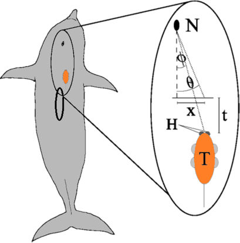

## Wearable audio arrays

In my Master's thesis, I explored the effects (if any) of different head morphologies in toothed whales, specifically as it pertains to lateral motion. Most toothed whales and dolphins have an intriguing trait in their fused cervical (neck) vertebrae (belugas and narwhals are notable exceptions). This clearly limits motion in the cervical region, so the question posed was, do whales move their heads laterally, and if so, how does that vary across the diverse head shapes seen in these animals?

### Detecting head motion

Head motion was calculated from onboard data loggers, specifically [D-TAGs](https://soundtags.wp.st-andrews.ac.uk/dtags/), which carry a two-hydrophone array. The short distance between the two hydrophones allows calculation (as shown below) of the angle of arrival of a sound, due to the difference in arrival times of that sound. As the study species are toothed whales, echolocating creatures, echolocation clicks proved the perfect source.

